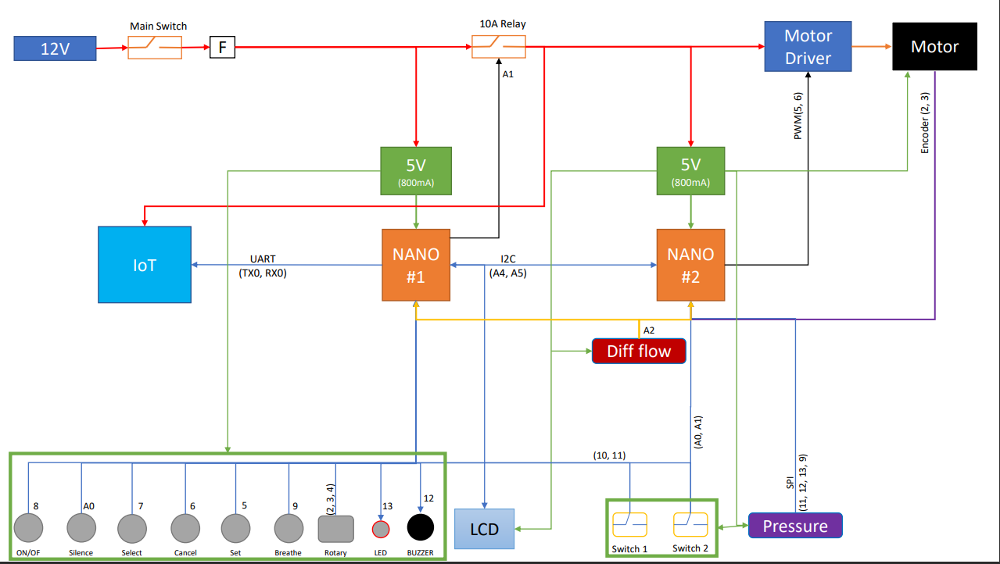

# LIBV Open Source Ventilator

Check out our [www.bvmvent.org](https://www.bvmvent.org/) for updates.

**The Problem:** The COVID-19 Pandemic has highlighted the scarcity of potentially life-saving resources around the world.

**Our Challenge:** Design and Engineer an Open Source, low cost (sub $150) ventilator using readily available materials for rapid deployment in developing countries where there may not be an alternative.

Who we are: A Collective of Engineers, Medics and Scientists from across the world, centred around a hub in Phnom Penh, Cambodia.
Help Us: We need Volunteers, a Community of Contributors and Donors to join us and help us deliver our vision.

# LIBV Electronics

The LIBV electronics are based on an Arduino Nano (Atmega328) architecture.

## 1. Electronics Circuit

Full PCB design using KiCAD [LIBV PCB](https://github.com/LIBVproject/LIBV-ventilator-pcb).

**Circuit Diagram**

## 2. Arduino Program

**Control Panel Loop**

  

